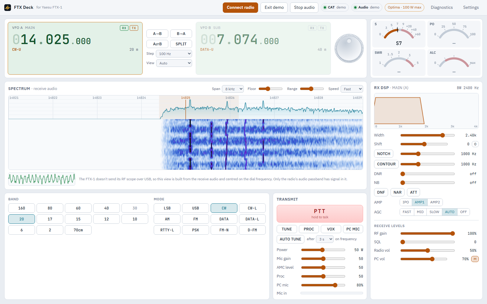
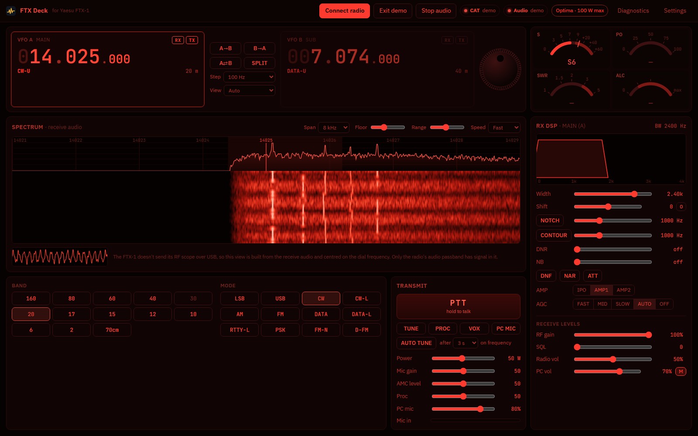
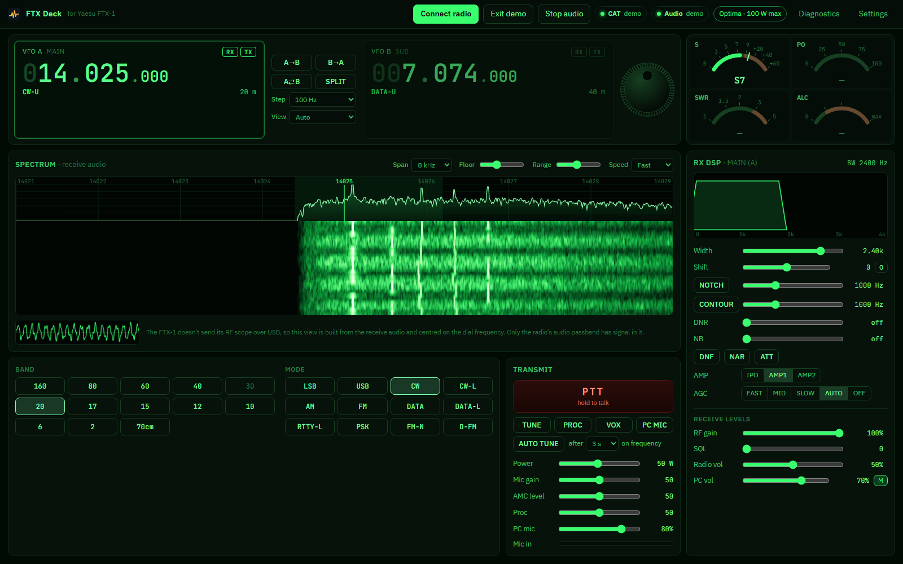
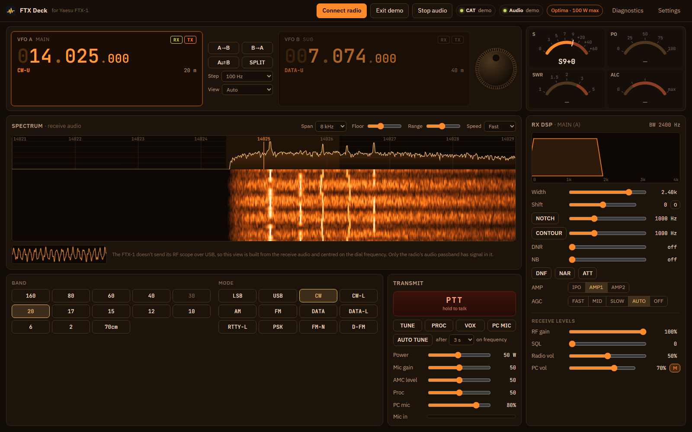
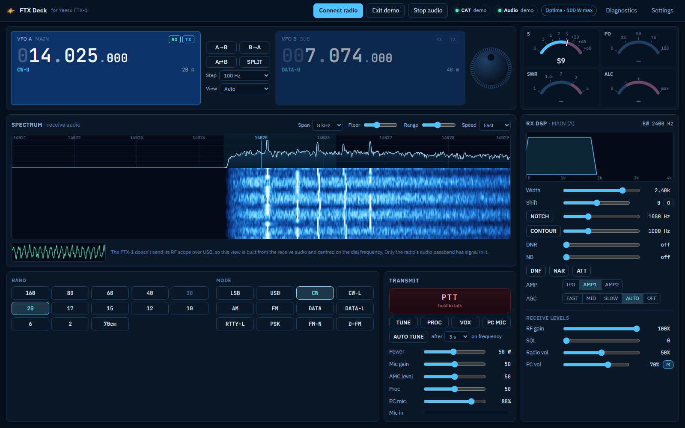

# FTX-1-WebUI
Web UI for the Yaesu FTX-1 that works in Chromium based browsers with no additional components to install. 

# FTX Deck

A control console for the **Yaesu FTX-1** (Field head or Optima/SPA-1) that runs in
Chrome or Edge. It talks to the radio over its USB cable: CAT control, two-way USB
audio, an audio waterfall, and live meters.

No install and no drivers beyond the radio's own USB driver. Nothing leaves your PC.


## What it does

- **VFO A (MAIN) and VFO B (SUB):** scroll over any digit to tune by that digit, or
  double-click to type a frequency, or spin the on-screen dial. Also A→B, B→A, swap, and split (RX on A, TX on B).
  When the radio is in single receive, only the selected VFO is shown, as on the
  radio's own screen.
- **Band buttons with band stacking:** each band remembers its last frequency and mode.
  A band's first visit goes to the lowest SSB voice frequency for your US license
  class (Technician, General or Amateur Extra, chosen in Settings). Click the band
  you're already on to go back there.
- **All the modes:** LSB, USB, CW, AM, FM, DATA, RTTY, PSK and so on.
- **Meters:** S, PO, SWR and ALC, driven by live readings from the radio.
- **Spectrum and waterfall of the receive audio**, centred on the dial frequency.
  Click a signal to tune it in:
  - CW: the signal lands on your pitch.
  - DATA: it lands at 1500 Hz.
  - SSB: click a signal's low edge.
- **RX DSP:**
  - width and IF shift, set from a live passband graphic (drag to shift, scroll to
    change width);
  - manual notch, contour, DNR, NB, DNF, narrow, ATT, IPO/AMP1/AMP2, AGC;
  - RF gain, squelch and the radio's own volume;
  - FM tone squelch: ENC, TSQ or DCS, with the CTCSS tone or DCS code.
- **Transmit:**
  - hold-to-talk PTT;
  - power (limited to what the Optima or Field head allows on the band), mic
    gain, AMC level, processor, VOX, TUNE with the internal or an external tuner;
  - optional **auto tune**: runs a tune cycle once you've moved 10 kHz or more (or
    changed band) and stayed on the new frequency for a few seconds;
  - optional **PC microphone** routed to the radio over USB.
- **Safety:**
  - a transmit timeout (3 min by default);
  - it unkeys when the window loses focus, the tab is hidden or closed, the link
    drops, or you press Esc.
- **Demo mode:** a simulated FTX-1 Optima and a synthetic band, so you can try
  everything without a radio.
- **Six colour themes**, chosen in Settings (below).

### Themes

| | |
|---|---|
|  **Shack** (default): dark, amber accents |  **Daylight**: light, for a bright room |
|  **Night red**: red on black, easy on night vision |  **Green phosphor**: monochrome terminal |
|  **Nixie**: warm orange glow |  **Blue LCD**: white on blue, like a rig's display |

### What it can't do

The FTX-1 doesn't send its spectrum-scope data to a PC; there's no USB
panadapter like the FT-710's. So the waterfall here is built from the receive
audio: only the radio's audio passband (about 3–4 kHz) has signal in it, not a
wide RF band view.

The USB audio isn't muted by the radio's squelch, so on FM you hear the noise
between transmissions on the PC even when the radio is quiet.

## Running it

You need [Node.js](https://nodejs.org) 18 or newer, and Chrome or Edge.

```bash
npm start
```

Then open **http://localhost:8765** in Chrome or Edge.

In VS Code, press **F5** and choose "FTX Deck in Edge" (or Chrome). This starts the
server and opens the browser for you.

> Open it from `http://localhost`, not by double-clicking `index.html`: browsers
> won't load the app's separate script files from a `file://` page. For a
> double-clickable copy, use the single-file build below.

### Single-file build

```bash
npm install     # once, for the bundler (esbuild)
npm run build
```

This writes `dist/ftx-deck.html`: the whole app, fonts included, in one file that
needs no server and no internet connection.

> **Known issue:** opened straight from disk, the browser doesn't keep the
> microphone permission, so Settings can't list the audio devices and audio can't
> start. Use `http://localhost` until that's fixed.

## Connecting the radio

1. Install the Silicon Labs CP210x driver from Yaesu's FTX-1 downloads page, if
   Windows hasn't already. The radio then shows two COM ports and a
   "USB Audio CODEC" sound device.
2. On the radio, the CAT rate defaults to 38400. If you've changed it, match it in
   **Settings**.
3. Click **Connect radio** and pick the **Enhanced COM** port. Don't pick the
   Standard one: its RTS/DTR lines can key the transmitter.
4. Click **Start audio**. The first time, the browser asks for microphone
   permission; that's how it reads the radio's receive audio. If the radio's input
   isn't picked automatically, choose **USB Audio CODEC** under Settings → Audio
   devices.

### Transmitting with the PC microphone

1. On the radio, set the SSB (and AM/FM) **MOD SOURCE** to **REAR** (USB). Settings
   differ by mode; check the FTX-1 manual.
2. In Settings, choose the radio's audio output (USB Audio CODEC) and your PC
   microphone.
3. Turn on **PC MIC**. Your mic is only sent to the radio while PTT is down.

Keep an eye on ALC and PO the first time, and set the level with the **PC mic**
slider.

## Project layout

```
index.html              page layout
css/app.css             styles, and the default theme's colours
css/themes.css          the other five themes
css/fonts.css           the two bundled typefaces (assets/fonts, SIL OFL 1.1)
js/main.js              wiring: controls, PTT safety, render loop
js/radio.js             RadioService: polling, state, setters, TX watchdog
js/cat/ftx1.js          FTX-1 CAT command builders, parsers, meter calibration
js/cat/cat-link.js      one-at-a-time CAT queue with coalescing
js/cat/transport.js     Web Serial transport
js/cat/mock-radio.js    simulated FTX-1 used by demo mode and tests
js/audio/audio-engine.js USB audio in/out, analyser, demo band
js/ui/                  VFO, meters, dial, spectrum/waterfall, passband views, themes
docs/FTX1-CAT-NOTES.md  protocol reference used by this project
test/                   Node tests (npm test)
scripts/serve.mjs       zero-dependency local web server
scripts/build.mjs       single-file build (dist/ftx-deck.html)
scripts/screenshots.mjs README screenshots (docs/screenshots)
```

## Development

```bash
npm test            # protocol, queue and radio-service tests against the simulated radio
npm run screenshots # rebuild, then retake docs/screenshots in headless Chrome or Edge
```

Adding a theme: add its colours to `css/themes.css` (every colour as `#rrggbb`,
since the canvases derive tints from them), then list it in `js/ui/theme.js` and
in `scripts/screenshots.mjs`.

The CAT details come from Yaesu's *FTX-1 CAT Operation Reference Manual* and the
open-source Hamlib FTX-1 backend; see `docs/FTX1-CAT-NOTES.md`. Items marked
**verify** there, the PO/SWR meter calibration in particular, still need checking
against a real radio.

## Status

Early: being pilot-tested on a real FTX-1, and tested throughout against the
simulated radio. If something doesn't respond, **Diagnostics** shows every CAT
command and reply; copy that into an issue.
