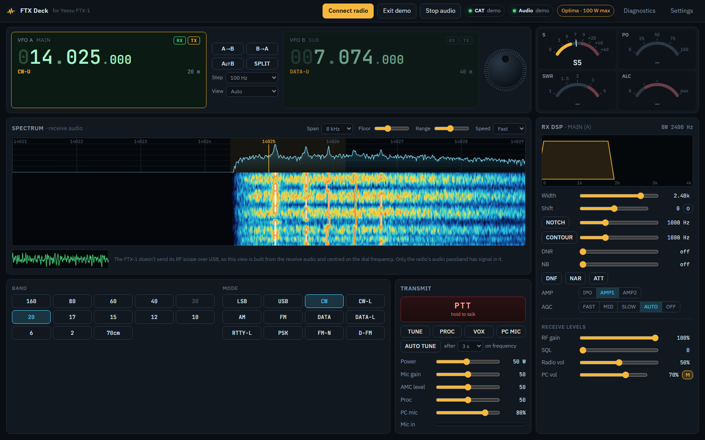

# FTX Deck user manual

FTX Deck controls a Yaesu FTX-1 (Field head, or Optima with the SPA-1) from Chrome
or Edge over the radio's USB cable. This manual goes through every part of the
screen, one area at a time. For installing and running FTX Deck, see the
[README](../README.md).

**Contents**

- [Requirements](#requirements)
- [Before you start](#before-you-start)
- [Top bar](#top-bar)
- [VFOs](#vfos)
- [Meters](#meters)
- [Spectrum and waterfall](#spectrum-and-waterfall)
- [RX DSP](#rx-dsp)
- [Receive levels](#receive-levels)
- [Band and mode](#band-and-mode)
- [Transmit](#transmit)
- [Settings](#settings)
- [Diagnostics](#diagnostics)
- [Keyboard and mouse shortcuts](#keyboard-and-mouse-shortcuts)
- [How FTX Deck stays in step with the radio](#how-ftx-deck-stays-in-step-with-the-radio)
- [Known limitations](#known-limitations)

---

## Requirements

- **A Yaesu FTX-1** (Field head, or Optima), connected to the PC with a USB
  cable from the radio's **side-panel USB jack**.
- **Chrome or Edge** on a desktop or laptop (Windows, macOS or Linux). Other
  browsers can't reach USB serial ports.
- **The radio's USB driver (Silicon Labs CP210x virtual COM port driver).**
  Without it the radio's COM ports don't appear and FTX Deck can't connect.

### Installing the USB driver (Windows 10 and 11)

1. Download **FTX-1 series USB Driver Virtual COM Port Driver (Windows 11/10)**
   from the Downloads section of [Yaesu's FTX-1 page](https://www.yaesu.com/product-detail.aspx?Model=FTX-1+Series&CatName=HF+Transceivers%2FAmplifiers),
   or directly: [CP210x_Universal_Windows_Driver.zip](https://www.yaesu.com/Files/BB2B47AE-1018-01AF-FAE48FDCB1919193/CP210x_Universal_Windows_Driver.zip).
2. Unzip it, right-click **silabser.inf** in the unzipped folder, and choose
   **Install**.
3. Connect the radio and switch it on. In **Device Manager → Ports (COM & LPT)**
   you should now see two entries:
   - **Silicon Labs Dual CP210x USB to UART Bridge: Enhanced COM Port**, the one
     FTX Deck uses;
   - **Silicon Labs Dual CP210x USB to UART Bridge: Standard COM Port**.

Yaesu's [Virtual COM Port Driver Installation Manual](https://www.yaesu.com/Files/BB2B47AE-1018-01AF-FAE48FDCB1919193/USB_Driver_Installation_Manual_ENG_2205-E.pdf)
(PDF) goes through the same steps with pictures.

**macOS and Linux:** Linux includes the CP210x driver, so the ports appear
without installing anything. On macOS, if the radio's ports don't appear, install
the driver from [Silicon Labs' CP210x driver page](https://www.silabs.com/software-and-tools/usb-to-uart-bridge-vcp-drivers?tab=downloads).

**Audio needs no driver.** The radio's sound device, named **USB Audio CODEC** or
**USB Audio Device** (with the USB ID 0d8c:0016), uses
the operating system's built-in USB audio support. Look for it under
**Sound, video and game controllers** in Device Manager.

For how to start FTX Deck itself, see the [README](../README.md#running-it).

---

## Before you start

- **Two USB connections come from one cable.** The radio appears as two COM
  ports (CAT control) and a sound device called **USB Audio CODEC** or **USB Audio
  Device (0d8c:0016)** (receive and
  transmit audio). FTX Deck uses both.
- **Always pick the Enhanced COM port.** The Standard COM port's control lines
  can key the transmitter.
- **Most controls act on the selected VFO.** Receive settings (width, shift,
  notch, AGC, levels and so on) apply to whichever VFO is selected, and the
  RX DSP heading shows which one: **MAIN (A)** or **SUB (B)**.
- **The radio and the app stay in sync both ways.** Change something on the
  radio and the app follows within a second or two; change it in the app and
  the radio follows.
- **Your settings are kept in this browser**, not in the radio: theme, tuning
  step, spectrum settings, audio devices and the rest. A different browser or PC
  starts with the defaults.

---

## Top bar

| Control | What it does |
|---|---|
| **Connect radio** | Opens the browser's port picker. Choose the radio's **Enhanced COM** port. Once connected, the app reads every setting from the radio, starts the receive audio, and the button changes to **Disconnect**. |
| **Disconnect** | Closes the link to the radio, stops the receive audio, turns **PC MIC** off and clears the waterfall. If you were transmitting, it unkeys first. |
| **Demo** | Starts demo mode: a simulated FTX-1 Optima and a synthetic band with CW, voice and FT8-like signals. Every control works, and nothing is sent to a real radio. The PC speakers start muted; press **M** under Receive levels to listen. Unavailable while a real radio is connected. |
| **Exit demo** | Leaves demo mode and restores your speaker mute setting. |
| **Start audio / Stop audio** | Starts or stops the radio's receive audio on the PC: the sound from your speakers, the spectrum, the waterfall and the oscilloscope. Connecting starts it for you. The first time, the browser asks for microphone permission, which is how a web page reads a sound input. |
| **CAT** indicator | The control link: **offline**, **connecting…**, **connected**, or **demo**. Green means working; amber means connected with a warning. |
| **Audio** indicator | The receive audio: **off**, **on**, or **demo**. Red means an audio error; the message appears in the banner. |
| **Configuration** indicator | Appears once connected, for example **Optima · 100 W max** or **Field head · 10 W max**. Shows which configuration the radio reports and the highest power allowed on the current band and mode. It updates if you fit or remove the SPA-1 while connected. |
| **Diagnostics** | Opens the [Diagnostics](#diagnostics) window. |
| **Settings** | Opens the [Settings](#settings) window. |

### Messages banner

Warnings and errors appear in a strip under the top bar: a rejected TUNE, a
transmit timeout, a lost connection, a missing audio device. Amber is a
notice; red is an error. **Dismiss** hides it.

---

## VFOs

### VFO displays (VFO A MAIN, VFO B SUB)

Each VFO shows its frequency in MHz, kHz and Hz, its mode, and its band (for
example **20 m**, or **GEN** outside the amateur bands).

| Part | What it does |
|---|---|
| **Clicking a VFO panel** | Selects that VFO on the radio. The selected VFO is highlighted, and it's the one that receives, and that the dial, band, mode and receive controls act on. |
| **Scrolling over a digit** | Tunes by that digit: scroll over the kHz digit to move 1 kHz a notch, the 10 Hz digit for 10 Hz, and so on. Scrolling elsewhere on the frequency uses the **Step**. |
| **Double-clicking the frequency** | Opens **Tune VFO A/B**, where you can type a frequency. `14.074` is read as MHz (it has a decimal point); `14074` without one is read as kHz. You can also type `14074 kHz` or `7.1 MHz`. Anything from 30 kHz to 470 MHz is accepted; the radio decides what it can actually receive. Press **Tune**, or **Cancel**. |
| **Keyboard on the frequency** | Click the frequency (or Tab to it), then: **↑ / →** up one step, **↓ / ←** down one step, **Page Up / Page Down** ten steps, **Enter** opens the typing box. |
| **RX tag** | Green when that VFO is receiving: the selected VFO, and VFO A as well while split is on. |
| **TX tag** | Amber on the VFO that transmits (VFO B with split on, otherwise the selected VFO). Turns solid red while you're on the air. |

### Buttons between the VFOs

| Control | What it does |
|---|---|
| **A→B** | Copies VFO A's frequency and mode to VFO B. |
| **B→A** | Copies VFO B's frequency and mode to VFO A. |
| **A⇄B** | Swaps the two VFOs' frequencies and modes. |
| **SPLIT** | Split operation: receive on VFO A, transmit on VFO B. Lit while on. Both VFOs are always shown while split is on. |
| **Step** | How far the frequency moves for one mouse-wheel notch, one arrow-key press or one dial step: 1 Hz to 25 kHz. Use 10–100 Hz for SSB and CW; the larger steps suit FM channels. |
| **View** | How many VFOs are shown. **Auto** follows the radio's single/dual receive setting. **1 VFO** shows only the selected one; **2 VFOs** always shows both. The radio's **DISP** button (its own screen layout) isn't reported over CAT, so use this to match it. |

### Tuning dial

The round knob at the right of the VFO panel tunes the selected VFO.

- **Drag it round:** clockwise goes up. One full turn is 60 steps of the
  current **Step**, so at 100 Hz a turn moves 6 kHz.
- **Flick it:** it keeps spinning briefly and slows down, like a weighted knob.
  Pause before letting go to stop exactly where you are; click the dial to stop
  a spin.
- **Mouse wheel over the dial:** one step per notch.
- **Keyboard** (click the dial first): **↑ / →** one step up, **↓ / ←** one
  step down, **Page Up / Page Down** ten steps.

The dial is hidden on narrow windows (under about 1240 px wide) while two VFOs
are shown, because they don't fit side by side.

---

## Meters

Four arc meters, top right. Each shows a live reading, a bar that eases toward
it, and a small tick that holds the recent peak for a moment.

| Meter | What it shows |
|---|---|
| **S** | Received signal strength of the selected VFO, from S0 to S9+60 dB. Active while receiving. |
| **PO** | Transmit power output in watts. Full scale follows the configuration and band (100 W, 50 W or 10 W). Active while transmitting or tuning. |
| **SWR** | Standing-wave ratio, from 1 to 5. The red zone starts at 3:1. Active while transmitting or tuning. |
| **ALC** | Automatic level control. Keep it low: when it climbs into the red, turn **Mic gain** (or **PC mic**) down. Active while transmitting. |

A meter that isn't active shows **—** and a dimmed scale.

---

## Spectrum and waterfall

A live picture of the receive audio, with the upper part showing signal level
across frequency and the waterfall below showing history (newest at the top).

**What you're seeing:** the FTX-1 doesn't send its own RF scope to a PC, so this
view is built from the radio's receive audio. It is centred on the selected
VFO's dial frequency (the amber line and label in the middle), and frequency
increases left to right. Only the radio's audio passband, about 3–4 kHz on SSB,
has signal in it: on USB that's the area right of centre, on LSB left of
centre, and on AM and FM both sides, mirrored. The faint amber band marks the
receive filter.

| Control | What it does |
|---|---|
| **Span** | Total width shown: 6, 8, 12 or 24 kHz. |
| **Floor** | The signal level shown as the bottom of the display. Raise it to hide the noise; lower it to see weak signals. It also sets the RX DSP graphic. |
| **Range** | How many dB the display covers from the floor up. Smaller values give more contrast. It also sets the RX DSP graphic. |
| **Speed** | How fast the waterfall scrolls: **Slow**, **Normal** or **Fast**. |
| **Hovering** | A line follows the pointer, and the box at the bottom shows the frequency the radio will tune to if you click there. |
| **Clicking a signal** | Tunes the selected VFO to it. **CW:** the signal lands on your CW pitch. **DATA / PSK:** it lands at 1500 Hz audio. **SSB:** click the signal's low edge on USB (high edge on LSB), which is where its carrier would be. **AM / FM:** tunes to the clicked frequency. |
| **Red dashed line** | The manual notch frequency, when NOTCH is on. |
| **Purple dotted line** | The contour frequency, when CONTOUR is on. |
| **Oscilloscope** (bottom left) | The receive audio waveform, for a quick look at audio level and tone. |

When you tune, the waterfall history slides sideways so signals stay where they
were. Switching VFO, or a large jump, clears it.

---

## RX DSP

The radio's receive filtering and noise controls. The heading shows which VFO
they act on (**MAIN (A)** or **SUB (B)**), and the top right shows the current
bandwidth and shift, for example **BW 2400 Hz · shift +200**.

### Passband graphic

The amber trapezoid is the receive filter, drawn over the live audio spectrum
(0 to 4 kHz of audio).

- **Drag sideways** to set IF shift.
- **Scroll** over it to widen or narrow the filter one step at a time.
- A **V cut** marks the manual notch; a **dip** on the top edge marks the contour.
- The top corners show **DNR n** when noise reduction is on and **DNF** when the
  auto notch is on.

### Controls

| Control | What it does |
|---|---|
| **Width** | Receive filter width. SSB: 300 Hz to 4 kHz. CW, DATA, RTTY and PSK: 50 Hz to 4 kHz. Greyed out in AM and FM, whose widths are fixed. |
| **Shift** | IF shift, moving the filter up or down by up to ±1200 Hz in 20 Hz steps without retuning. **0** centres it again. |
| **NOTCH** + slider | The manual notch: switch it on, then set the frequency (10–3200 Hz) to cut out a steady tone or carrier. |
| **CONTOUR** + slider | The contour: switch it on, then set the frequency (10–3200 Hz) of a gentle dip, to soften one part of the audio. |
| **DNR** | Digital noise reduction, **off** or 1–10. Higher is stronger but can make voices sound processed. |
| **NB** | Noise blanker for impulse noise such as ignition or power-line clicks, **off** or 1–10. |
| **DNF** | Digital auto notch: finds and removes steady tones automatically. |
| **NAR** | Narrow: switches the radio's filter to its narrow setting. |
| **ATT** | 12 dB attenuator, for very strong signals or overload. |
| **AMP** | The receive preamp. On HF and 6 m: **IPO** (no preamp, best for strong signals), **AMP1** or **AMP2** (most gain). On 2 m and 70 cm: **ON** or **OFF**. It changes with the band, not the mode. |
| **AGC** | Automatic gain control: **FAST**, **MID**, **SLOW**, **AUTO** (the radio picks for the mode) or **OFF**. |

---

## Receive levels

At the bottom of the RX DSP panel.

| Control | What it does |
|---|---|
| **RF gain** | The receiver's front-end gain, 0–100%. Normally 100%. Turn it down to cut noise and overload on a crowded band, at the cost of weak signals. It affects everything, including the PC audio and the waterfall. |
| **SQL** | Squelch threshold, 0–100: silences the radio when no signal is above that level. Mostly for FM; leave it at 0 on SSB. It doesn't silence the PC audio (see [Known limitations](#known-limitations)). |
| **Radio vol** | The radio's own speaker and headphone volume, 0–100%. It doesn't change the PC audio, so you can turn it down to keep the radio quiet while you listen on the PC. |
| **PC vol** | The volume of the radio's audio on your PC speakers. Nothing is sent to the radio. |
| **M** | Mutes the PC speakers. Lit while muted. |

RF gain, SQL and Radio vol act on the selected VFO.

---

## Band and mode

### Band

Buttons for **160, 80, 60, 40, 30, 20, 17, 15, 12, 10, 6, 2** and **70cm**. The
current band is highlighted.

- **Band stacking:** each band remembers the last frequency and mode you used
  there, and a band button takes you back to it.
- **First visit:** a band you haven't used yet opens on the lowest SSB voice
  frequency your license class allows (set in [Settings](#settings)), in LSB
  below 10 MHz and USB above (60 m uses USB).
- **Click the band you're already on** to go back to that starting frequency.
- **Dimmed band buttons** are bands where your license class has no SSB voice
  privileges (30 m for everyone, and several HF bands for Technicians). They
  still work, and go to the band's general default frequency and mode instead.

### Mode

**LSB, USB, CW** (CW upper), **CW-L, AM, FM, DATA** (DATA upper), **DATA-L,
RTTY-L, PSK, FM-N** (narrow FM) and **D-FM** (data FM). The current mode is
highlighted. Changing mode changes the Width choices.

### Tone (FM modes only)

Appears under the Mode buttons when the selected VFO is in FM, FM-N, D-FM or
narrow data FM.

| Setting | What it does |
|---|---|
| **Off** | No tone. |
| **Tone (ENC)** | Sends the chosen CTCSS tone when you transmit; what most repeaters need. |
| **Tone squelch (TSQ)** | Sends the tone, and also keeps your squelch closed unless a received signal carries it. |
| **DCS** | Digital coded squelch, with the chosen DCS code. |
| **PR freq** | The radio's PR frequency squelch. |
| **Reverse tone** | Squelch that closes when the tone is present. |
| Tone list | For ENC, TSQ and Reverse tone: the CTCSS tone, 67.0–254.1 Hz. |
| Code list | For DCS: the code, D023–D754. |

---

## Transmit

The top right of the panel shows how long you've been transmitting and the
limit (for example **TX 12 s / 180 s**), or a countdown when auto tune is about
to run.

| Control | What it does |
|---|---|
| **PTT** | Transmit. By default, **hold** it to transmit and let go to stop. With **PTT button latches** turned on in Settings, click once to start and again to stop. It's greyed out until a radio (or demo) is connected. |
| **TUNE** | Starts a tune cycle on whichever tuner the radio has selected: the Optima's internal tuner, an external tuner on the TUNER/LINEAR jack, or an ATAS antenna. The button reads **TUNING…** while it runs and returns to **TUNE** when the radio stops sending its tuning carrier. Press it again during a cycle to stop it. If the radio refuses, the banner says what its tuner is set to and what to check. |
| **PROC** | The speech processor on/off; set its level with the **Proc** slider. |
| **VOX** | The radio's voice-operated transmit on/off. |
| **PC MIC** | Sends your PC microphone to the radio while PTT is down. The microphone is muted at all other times, so **Mic in** only moves while you transmit. Needs the audio devices chosen in Settings, and the radio's **MOD SOURCE** set to **USB** or **AUTO** for each mode you use (RADIO SETTING → MODE SSB, AM, FM, DATA); with **MIC** the radio transmits its own microphone instead, and FTX Deck warns you. |
| **AUTO TUNE** | When on, runs a tune cycle by itself once your transmit frequency has moved 10 kHz or more from where the tuner last ran (or you've changed band) and then stayed put. |
| **after … on frequency** | How long the frequency must stay still before auto tune runs: 2, 3, 5 or 10 seconds. |
| **Power** | Transmit power. The range follows the radio: 5–100 W on the Optima (5–50 W on 2 m and 70 cm, less in AM), 0.5–10 W on the Field head (0.5–6 W on its battery). The radio keeps a separate power setting per band. |
| **Mic gain** | The radio's microphone gain, 0–100. |
| **AMC level** | The radio's automatic mic-level control, 0–100. |
| **Proc** | Speech processor level, 0–100 (switch it on with **PROC**). |
| **PC mic** | How loud your PC microphone is sent to the radio, 0–100%. Set it while watching ALC and PO. |
| **Mic in** | Your PC microphone's level: green is fine, amber loud, red too loud. Moves only while transmitting with PC MIC on. |

### Auto tune in detail

- It never runs just because you switched it on or connected: wherever you are
  then counts as already tuned.
- The countdown restarts whenever the frequency moves, so scrolling or spinning
  the dial never triggers it.
- **Transmitting on the new frequency cancels it**, so a tuning carrier never
  lands in the middle of a contact.
- It only runs on HF and 6 m, and only once per frequency, even if the radio
  refuses. Pressing TUNE yourself also counts.
- It doesn't run while the browser tab is hidden; you get the full delay when
  you come back.
- It follows your transmit frequency, so with split on it watches VFO B. It
  also reacts to tuning on the radio itself.
- Each auto tune is a short transmission, so only use it where you're happy for
  that to happen.

### Transmit safety

FTX Deck unkeys the radio when any of these happens:

- the **Transmit timeout** set in Settings runs out (3 minutes by default);
- you press **Esc**;
- the browser window loses focus (unless PTT latching is on in Settings);
- the tab is hidden, or the page is closed or reloaded;
- the connection to the radio drops.

---

## Settings

Opened with **Settings** in the top bar. Changes apply immediately; **Done**
closes the window.

### Radio link

| Setting | What it does |
|---|---|
| **Baud rate** | The CAT speed. Must match the radio's CAT-1 RATE menu (38400 unless you've changed it). Takes effect the next time you connect. |

### Appearance

| Setting | What it does |
|---|---|
| **Theme** | The colour scheme: **Shack** (default, dark), **Daylight** (light, for a bright room), **Night red** (red on black, easy on night vision), **Green phosphor**, **Nixie** (warm orange), or **Blue LCD**. Changing theme clears the waterfall history. |

### Operator

| Setting | What it does |
|---|---|
| **US license class** | **Technician**, **General** or **Amateur Extra**. Decides where a band button goes on its first visit, and which band buttons are dimmed. |

### Audio devices

| Setting | What it does |
|---|---|
| **Radio audio in (receive)** | The radio's audio input on the PC: **USB Audio CODEC**, or **Microphone (USB Audio Device) (0d8c:0016)**. Picked automatically when found. |
| **Radio audio out (transmit)** | The radio's audio output on the PC: **USB Audio CODEC**, or **Speakers (USB Audio Device) (0d8c:0016)**. Used by PC MIC. |
| **PC speakers** | Where the receive audio plays. |
| **PC microphone** | The microphone PC MIC sends to the radio. |
| **Refresh device list** | Re-reads the list of sound devices, for example after plugging something in. The browser may ask for microphone permission. |

### Safety

| Setting | What it does |
|---|---|
| **Transmit timeout** | The longest a single transmission can last before the app unkeys: 1, 2, 3, 5 or 10 minutes. |
| **Hold space bar to transmit** | While on, holding the space bar transmits, as long as you're not typing in a box. |
| **PTT button latches** | While on, the PTT button toggles: click to start, click again to stop. |

---

## Diagnostics

Opened with **Diagnostics** in the top bar.

- **The summary line** shows the link (port, radio ID, configuration) and
  counts of commands sent, replies received, timeouts, and commands the radio
  rejected (`?;`).
- **The log** shows the most recent 200 lines of traffic: `>` is a command sent
  to the radio and `<` is its reply.
- **Copy** puts the summary and log on the clipboard, ready to paste into a bug
  report.
- **Close** closes the window.

If a control doesn't seem to reach the radio, look for a `< ?;` straight after
its command: that means the radio refused it.

---

## Keyboard and mouse shortcuts

| Where | Action | Result |
|---|---|---|
| A VFO frequency | Scroll over a digit | Tune by that digit |
| A VFO frequency | Scroll elsewhere on it | Tune by the Step |
| A VFO frequency | Double-click, or Enter | Type a frequency |
| A VFO frequency (focused) | ↑ → / ↓ ← | One step up / down |
| A VFO frequency (focused) | Page Up / Page Down | Ten steps up / down |
| A VFO panel | Click | Select that VFO |
| Tuning dial | Drag round, or flick | Tune the selected VFO |
| Tuning dial | Scroll | One step per notch |
| Tuning dial (focused) | ↑ → / ↓ ← / Page Up / Page Down | One or ten steps |
| Spectrum or waterfall | Click | Tune to the signal |
| RX DSP graphic | Drag sideways | IF shift |
| RX DSP graphic | Scroll | Filter width |
| RX DSP, receive-level and transmit sliders | Scroll | Nudge the value |
| Anywhere | Hold Space | Transmit (if turned on in Settings) |
| Anywhere | Esc | Stop transmitting |

---

## How FTX Deck stays in step with the radio

- FTX Deck asks the radio for its state several times a second: frequency,
  meters and transmit state constantly, the other settings in rotation, so
  everything is refreshed every second or two.
- When you change something in the app, the display updates at once and the app
  briefly ignores the radio's older reading, so sliders don't jump back while
  you drag them.
- Changes made on the radio's own knobs and menus show up in the app on the
  next refresh.

---

## Known limitations

- **No RF band scope.** The FTX-1 doesn't send its spectrum-scope data over USB,
  so the waterfall shows the receive audio only (about 3–4 kHz), not a wide view
  of the band.
- **The PC audio ignores the squelch.** The radio's USB audio isn't muted by its
  squelch, so on FM you hear the noise between transmissions on the PC even when
  the radio is quiet. Use **M** or **PC vol** if it bothers you.
- **The DISP screen layout isn't reported.** Use **View** to show one or two
  VFOs.
- **Battery detection on the Field head is indirect.** The app assumes 13.8 V
  (10 W) until the radio refuses a setting above 6 W, then limits Power to 6 W
  until you reconnect.
- **The single-file version can't list audio devices** when opened straight from
  disk, because the browser doesn't keep the microphone permission there. Use
  the hosted version at https://git-jcw.github.io/FTX-1-WebUI/ or the
  `http://localhost` version instead.
- **PC MIC needs the radio's audio output to itself.** If another program (WSJT-X,
  fldigi and the like) or another FTX Deck tab holds the radio's playback device,
  or Windows has it in exclusive mode, the browser can't open it and PC MIC turns
  itself off with a message. Close the other program or tab, or in Windows open
  **Sound settings → More sound settings → Playback → the radio's Speakers →
  Properties → Advanced**, untick **Allow applications to take exclusive
  control**, and set the format to **16 bit, 48000 Hz**.
- **Some radio reports are unconfirmed.** A few readings (the PO and SWR meter
  scales in particular) come from documentation rather than measurements on a
  real radio. If something looks wrong, **Diagnostics → Copy** and report it.
